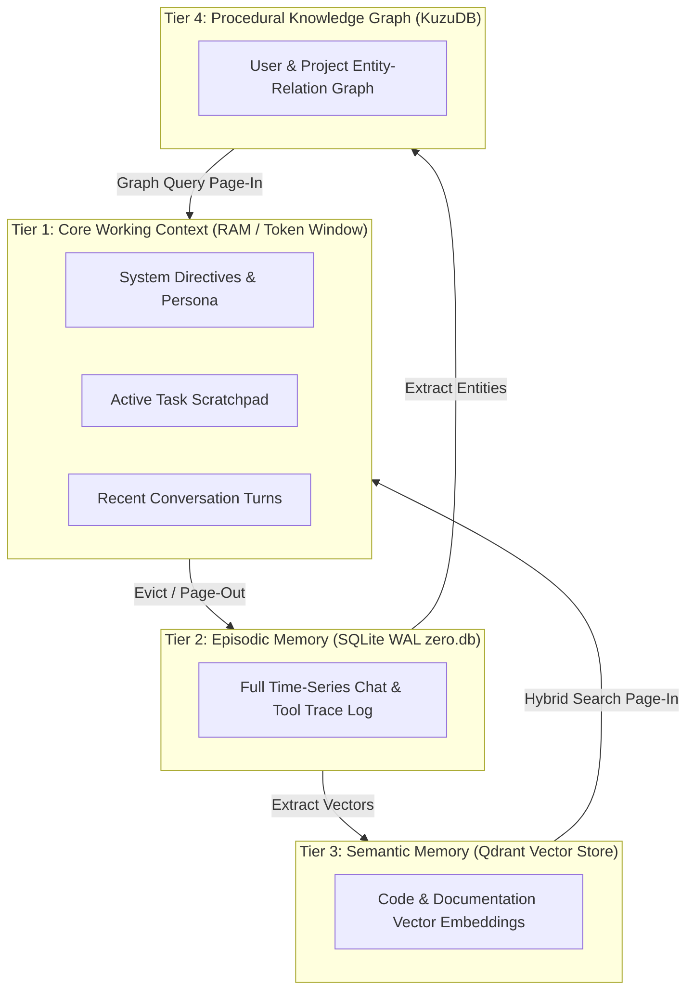

# MEMORY_GUIDE.md — Cognitive Memory Subsystem Guide for Project ZERO

This document details how Project ZERO stores, retrieves, pages, and reflects upon cognitive memory across 4 distinct tiers.

---

## 1. The 4-Tier Memory Architecture

---

## 2. Context Construction & Paging Algorithm

1. **Token Budget Allocation**: System directive (10%), Active Plan Scratchpad (15%), Injected Memory & RAG (25%), Recent Conversation Turns (50%).
2. **Page-Out Eviction**: When context token count exceeds 80% capacity, the oldest turns are evicted, saved to SQLite Tier 2, summarized, and pushed to Qdrant Tier 3.
3. **Hybrid Page-In Retrieval**: Queries retrieve relevant memories by combining Qdrant dense vector search with SQLite FTS5 BM25 keyword matching via Reciprocal Rank Fusion (RRF).

---

## 3. Learning & Trajectory Post-Mortem Analysis

- **Offline Reflection**: When the system is idle, the Learning Engine inspects un-analyzed task logs in Tier 2.
- **Failure Mining**: Recurring error patterns generate new system rules stored in Tier 3 ("When compiling C++ on Windows, pass `-std=c++20`").
- **Macro Workflow Synthesis**: Successful multi-step tool call sequences are packaged into reusable single-step macros.
