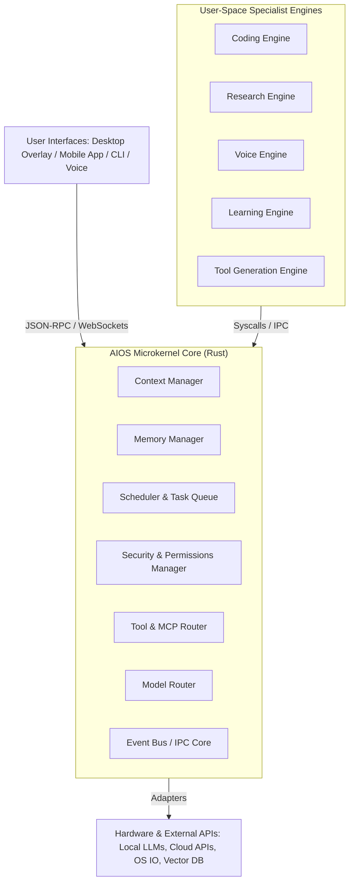
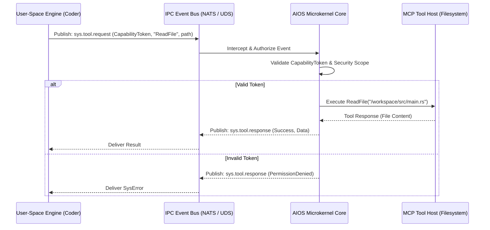
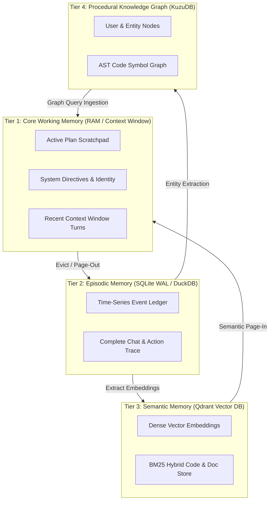
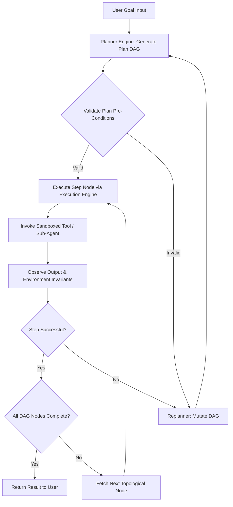
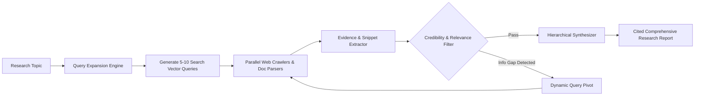
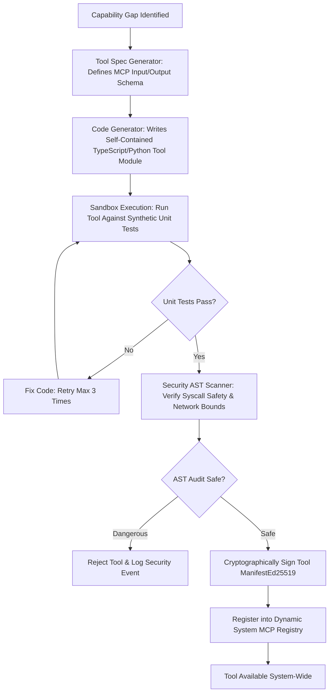
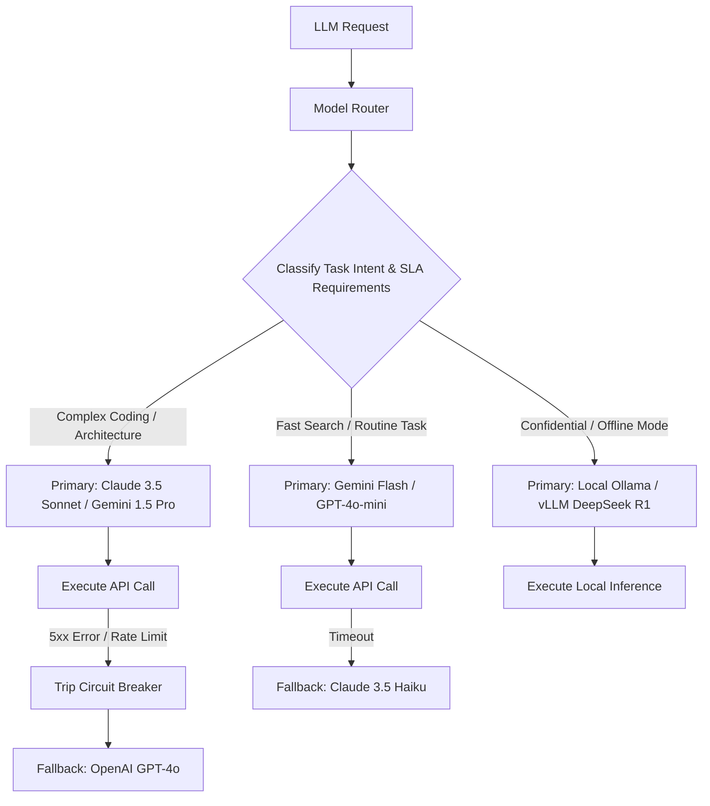
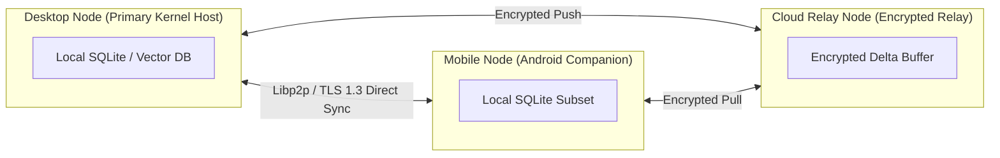

# AIOS (AI Operating System) Master Architecture Specification & Technical Roadmap

**Author:** Principal AI Systems Architect  
**Target System:** Personal Autonomous Cognitive Operating System (JARVIS / FRIDAY Archetype)  
**Specification Version:** 1.0.0-PROD  
**Status:** Approved Master Architecture & Engineering Blueprint (Phase 0)  

---

## Executive Overview

Modern Large Language Models (LLMs) and Multimodal Models (LMMs) have transitioned from statistical completion engines into computational primitive kernels—essentially "reasoning CPUs." However, contemporary AI client software remains heavily constrained: chat interfaces operate as transient, stateless document processors; agent frameworks (LangGraph, CrewAI, AutoGen) function as domain-specific application libraries; and developer harnesses (Claude Code, Codex, Manus) focus narrowly on ephemeral workspace task loops.

This document presents the definitive architecture for **AIOS (AI Operating System)**—a persistent, multi-device, self-improving, capability-expanding cognitive operating system designed to run continuously across desktop, mobile, cloud, and edge hardware. Rather than treating AI as an application *on* an OS, AIOS structures the AI *as* the OS kernel, orchestrating raw compute (LLM inference), dynamic storage (multi-tiered semantic/episodic memory), process execution (sandboxed tools and sub-agents), system events (sensors, UI state, device IO), and safety primitives (permission gates, cryptographic capability tokens).

---

## Table of Contents

1. [Current State of the Art](#1-current-state-of-the-art)
2. [Competitive Analysis](#2-competitive-analysis)
3. [Existing Agent Framework Comparison](#3-existing-agent-framework-comparison)
4. [Architecture Recommendation](#4-architecture-recommendation)
5. [Module Breakdown (16 Core Subsystems)](#5-module-breakdown-16-core-subsystems)
6. [Communication Architecture](#6-communication-architecture)
7. [Memory Architecture](#7-memory-architecture)
8. [Planning Architecture](#8-planning-architecture)
9. [Research Architecture](#9-research-architecture)
10. [Learning Architecture](#10-learning-architecture)
11. [Tool Generation Architecture](#11-tool-generation-architecture)
12. [Security Architecture](#12-security-architecture)
13. [Permission System](#13-permission-system)
14. [Model Routing Strategy](#14-model-routing-strategy)
15. [Persistence Strategy](#15-persistence-strategy)
16. [Device Synchronization Strategy](#16-device-synchronization-strategy)
17. [Technology Stack Recommendation](#17-technology-stack-recommendation)
18. [Repository Structure](#18-repository-structure)
19. [Development Phases](#19-development-phases)
20. [Risk Analysis](#20-risk-analysis)
21. [Future Research Directions](#21-future-research-directions)
22. [Features Excluded From Initial Build](#22-features-excluded-from-initial-build)
23. [Phased Roadmap (MVP to World-Class AIOS)](#23-phased-roadmap-mvp-to-world-class-aios)

---

## 1. Current State of the Art

The landscape of autonomous AI systems in 2025–2026 reflects a transition from static conversational interfaces to dynamic execution environments. Key architectural trends across state-of-the-art platforms include:

```
+-----------------------------------------------------------------------------------+
|                            PARADIGM SHIFTS IN SOTA AIOS                           |
+---------------------+-----------------------+---------------------+---------------+
|  1. Context Engineering | 2. Agent Harnessing  | 3. Tool Standardization | 4. Durable Exec|
|  - Dynamic token    | - External memory     | - Model Context     | - Temporal state|
|    compression      | - File/shell tools    |   Protocol (MCP)    |   snapshots   |
|  - Structured DBs   | - Micro-loops (nO)    | - Declarative UI    | - Crash proof |
+---------------------+-----------------------+---------------------+---------------+
```

### Deep-Dive on Leading Systems

#### Claude Code (Anthropic)
*   **Architecture**: Local terminal harness around Claude 3.5 Sonnet / Claude 3.7 Sonnet. Operates via an explicit tool-execution harness loop ("nO loop").
*   **Key Innovation**: Native adoption of the Model Context Protocol (MCP) and file-system/git-native context injection. Context management relies on project directory parsing, dynamic diff generation, and AST-aware file searches.
*   **Limitation**: Ephemeral CLI process lifecycle; lacks background daemon persistence, multi-device synchronization, or multi-modal voice/screen background loops.

#### Manus
*   **Architecture**: Fully autonomous cloud-based agent operating inside an isolated Ubuntu virtual machine.
*   **Key Innovation**: *Context Engineering* over model weight fine-tuning. Employs prompt-architecture search, dynamic environment state inspection, and zero hardcoded tools (generates code scripts on the fly to interact with APIs and browser windows).
*   **Limitation**: Centralized cloud SaaS sandbox; high token cost; lacks personal identity continuity across sessions; non-local compute.

#### Deep Research Systems (OpenAI / Gemini / Perplexity)
*   **Architecture**: Multi-phase hierarchical planner-worker graph.
*   **Key Innovation**: Recursive query expansion, web-graph navigation, iterative source verification, and structured report synthesis. Employs durable execution engines to maintain state across dozens of web crawls.
*   **Limitation**: Read-only research synthesis; cannot execute code, write files, or interact with local user desktop environments.

#### AIOS (LLM Agent Operating System - AGI Research)
*   **Architecture**: Academic kernel prototype decoupling LLM application agents from underlying hardware and model compute API callers.
*   **Key Innovation**: Introduced explicit OS kernel concepts to AI: LLM Scheduler (FIFO / Round-Robin API allocation), Memory Manager (Context swapping between active RAM and disk), and Tool Manager.
*   **Limitation**: Early-stage Python prototype lacking production security sandboxing, multi-device synchronization, or local voice loops.

#### Model Context Protocol (MCP)
*   **Architecture**: Standardized client-server protocol over JSON-RPC 2.0 (stdio / SSE / HTTP).
*   **Key Innovation**: Universally decouples LLM applications (clients) from data sources and tools (servers). Allows dynamic attachment of third-party capabilities (filesystems, databases, browser automations, Slack/GitHub integrations).

---

## 2. Competitive Analysis

| System | Core Architecture | Execution Environment | Memory Persistence | Self-Extension | Multi-Device Sync | AIOS Relevance |
| :--- | :--- | :--- | :--- | :--- | :--- | :--- |
| **Claude Code** | Terminal Harness + MCP | Local Node/Terminal | Ephemeral Workspace | Manual MCP Additions | None | **High** (Adopt harness loop & MCP integration) |
| **Manus** | Context Engineering + Multi-Agent | Cloud Ubuntu VM | Ephemeral Session | Dynamic Python Scripts | Cloud Web App | **High** (Adopt sandbox & context engineering) |
| **Deep Research** | Hierarchical Plan Graph | Cloud Worker Pool | Per-Task Report | None | Cloud Web App | **Medium-High** (Adopt research synthesis graph) |
| **MemGPT / Letta** | Virtual Context Paging | Python Service | Persistent Core/Archival | Tool Registration | Server Database | **Critical** (Adopt memory paging model) |
| **AIOS Kernel** | Python OS Kernel Prototype | Local Process | Mock Page Swapper | Static Tools | None | **Critical** (Adopt kernel scheduler & abstraction) |
| **AutoGen 0.4+** | Async Actor Bus | Cross-Language Actors | State Checkpoints | Dynamic Agent Spawning| Distributed Network| **High** (Adopt actor-based IPC messaging) |

---

## 3. Existing Agent Framework Comparison

```
                       +-----------------------------------+
                       |    AGENT FRAMEWORK TAXONOMY       |
                       +-----------------------------------+
                                         |
         +-------------------------------+-------------------------------+
         |                               |                               |
[GRAPH / STATE-MACHINE]         [ACTOR ENGINE]               [ROLE / TASK PIPELINE]
 LangGraph, LlamaIndex           AutoGen 0.4+                       CrewAI
 - Explicit graph nodes          - Event-driven message pass        - Strict role assignment
 - Deterministic state transitions - Distributed async execution    - Sequential/hierarchical loops
 - Complex logic control         - Scalable worker actors           - Quick prototype setups
```

### Comparative Analysis Matrix

1. **LangGraph**
   - *Pros*: Excellent for deterministic sub-graphs (e.g., code verification loops). Built-in persistence checkpoints.
   - *Cons*: Graph schemas are static at compile-time; difficult for agents to dynamically reconfigure their own graph topology on the fly.

2. **AutoGen 0.4+**
   - *Pros*: Built on an event-driven actor model (`autogen-core`). Agents communicate via asynchronous message passing across network boundaries. Supports distributed scaling across machines.
   - *Cons*: Higher protocol overhead; requires robust broker management.

3. **CrewAI**
   - *Pros*: Intuitive high-level role abstractions (e.g., "Senior Developer", "Code Reviewer").
   - *Cons*: Heavy opinionated overhead; lacks raw kernel primitives for memory paging, token scheduling, and process sandboxing.

### Conclusion for AIOS
AIOS will not rely on a monolithic third-party framework. Instead, AIOS implements an internal **Actor-based IPC Core** (inspired by AutoGen 0.4+) while using **Dynamic Sub-Graph Execution** (inspired by LangGraph) for specialized worker tasks.

---

## 4. Architecture Recommendation

### Microkernel Architecture for AI (AIOS Core)

AIOS adopts a **Modular Microkernel Architecture** inspired by modern microkernel operating systems (L4, QNX) and cloud-native event-driven actor engines.



### Microkernel System Call (Syscall) Specification

User-Space engines interact with the AIOS microkernel through explicit, strongly typed system calls:

```rust
// AIOS Microkernel System Call Interface Definition (Rust Pseudocode)
pub trait AiosSyscallInterface {
    // Memory Management
    fn sys_mem_query(&self, query: MemoryQuery) -> Result<Vec<MemoryChunk>, SysError>;
    fn sys_mem_commit(&self, record: MemoryRecord) -> Result<MemoryId, SysError>;
    
    // Process & Task Execution
    fn sys_task_spawn(&self, task_spec: TaskSpec) -> Result<TaskId, SysError>;
    fn sys_task_yield(&self, task_id: TaskId) -> Result<(), SysError>;
    
    // Tool & Sandbox Access
    fn sys_tool_execute(&self, token: CapabilityToken, tool_name: &str, params: Value) -> Result<ToolResult, SysError>;
    
    // Security & Authorization
    fn sys_sec_request_capability(&self, scope: PermissionScope) -> Result<CapabilityToken, SysError>;
    
    // Model Inference Routing
    fn sys_model_complete(&self, prompt_req: InferenceRequest) -> Result<InferenceResponse, SysError>;
}
```

---

## 5. Module Breakdown (16 Core Subsystems)

AIOS is composed of 16 decoupled, independently testable subsystem modules:

```
+----------------------------------------------------------------------------------------------------+
|                                      AIOS SUBSYSTEM MATRIX                                         |
+--------------------------+--------------------------+-----------------------+----------------------+
| 1. Memory Manager        | 2. Tool Manager          | 3. Planning Engine    | 4. Knowledge Engine  |
| 5. Execution Engine      | 6. Scheduler             | 7. Task Queue         | 8. Context Manager   |
| 9. Identity Manager      | 10. Plugin Manager       | 11. Learning Engine   | 12. Security Manager |
| 13. Model Router         | 14. Device Manager       | 15. Voice Engine      | 16. Research Engine  |
+--------------------------+--------------------------+-----------------------+----------------------+
```

### Subsystem Technical Specifications

#### 1. Memory Manager
*   **Responsibility**: Manages 4 memory tiers (Core, Episodic, Semantic, Knowledge Graph). Executes memory paging, context compression, and decay indexing.
*   **Interfaces**: `sys_mem_query()`, `sys_mem_commit()`, `page_out_context()`, `compact_episodes()`.

#### 2. Tool Manager
*   **Responsibility**: Hosts the MCP Client/Server registry, manages dynamic tool loading, verifies tool schemas, and routes tool invocation requests.
*   **Interfaces**: `register_mcp_server()`, `invoke_tool()`, `get_tool_catalog()`, `quarantine_tool()`.

#### 3. Planning Engine
*   **Responsibility**: Converts natural language goals into executable Directed Acyclic Task Graphs (DAGs). Performs runtime plan monitoring, evaluation, and repair.
*   **Interfaces**: `create_plan_dag()`, `evaluate_node()`, `repair_dag()`, `check_invariants()`.

#### 4. Knowledge Engine
*   **Responsibility**: Maintains personal entities, codebase structures, symbol tables, and domain facts in a graph database.
*   **Interfaces**: `upsert_entity()`, `query_graph_path()`, `extract_code_symbols()`, `prune_graph()`.

#### 5. Execution Engine
*   **Responsibility**: Spawns and monitors air-gapped sandboxes (WebAssembly / gVisor containers) for running untrusted tool code and terminal commands.
*   **Interfaces**: `create_sandbox()`, `exec_in_sandbox()`, `destroy_sandbox()`, `capture_io()`.

#### 6. Scheduler
*   **Responsibility**: Allocates token bandwidth, rate limits, and processing time across competing agent threads using Priority Fair-Share scheduling.
*   **Interfaces**: `enqueue_job()`, `preempt_job()`, `yield_tokens()`, `get_queue_telemetry()`.

#### 7. Task Queue
*   **Responsibility**: Provides transactional, persistent background task queuing backed by SQLite WAL storage with at-least-once delivery guarantees.
*   **Interfaces**: `push_task()`, `pop_task()`, `ack_task()`, `nack_task()`, `checkpoint_state()`.

#### 8. Context Manager
*   **Responsibility**: Computes token usage, formats dynamic prompt context, injects relevant memory references, and enforces window bounds.
*   **Interfaces**: `build_prompt_context()`, `estimate_tokens()`, `truncate_scratchpad()`, `inject_episodes()`.

#### 9. Identity Manager
*   **Responsibility**: Manages user cryptographic credentials, persona profiles, preference vectors, and security signing keys.
*   **Interfaces**: `get_user_profile()`, `sign_payload()`, `verify_signature()`, `decrypt_credential()`.

#### 10. Plugin Manager
*   **Responsibility**: Dynamically loads, validates, updates, and unloads third-party MCP servers, extension agents, and custom UI components.
*   **Interfaces**: `load_plugin()`, `unload_plugin()`, `verify_plugin_manifest()`, `list_plugins()`.

#### 11. Learning Engine
*   **Responsibility**: Performs offline analysis of agent execution traces, extracts workflow macros, updates rule memories, and synthesizes tool proposals.
*   **Interfaces**: `ingest_trajectory()`, `extract_reflections()`, `propose_workflow_macro()`, `optimize_prompts()`.

#### 12. Security Manager
*   **Responsibility**: Enforces security policies, issues Ed25519 Capability Tokens, scans code ASTs for dangerous syscalls, and manages user consent prompts.
*   **Interfaces**: `validate_capability()`, `scan_code_safety()`, `request_user_consent()`, `audit_event()`.

#### 13. Model Router
*   **Responsibility**: Evaluates cost, latency, SLA, and privacy parameters to dynamically route LLM inference requests to optimal cloud or local providers.
*   **Interfaces**: `select_provider()`, `execute_inference()`, `trip_circuit_breaker()`, `get_cost_accounting()`.

#### 14. Device Manager
*   **Responsibility**: Discovers, authenticates, and synchronizes state across connected devices (Desktop, Mobile, Cloud Relay, Wearables).
*   **Interfaces**: `register_node()`, `broadcast_crdt_delta()`, `send_device_push()`, `get_node_status()`.

#### 15. Voice Engine
*   **Responsibility**: Manages real-time Speech-to-Text (STT), Text-to-Speech (TTS), wake-word detection, and streaming audio buffers.
*   **Interfaces**: `start_audio_stream()`, `synthesize_speech()`, `interrupt_speech()`, `set_voice_persona()`.

#### 16. Research Engine
*   **Responsibility**: Orchestrates multi-step web crawling, documentation fetching, query expansion, source evaluation, and research report synthesis.
*   **Interfaces**: `execute_research_job()`, `crawl_url()`, `rate_source_credibility()`, `compile_synthesis()`.

---

## 6. Communication Architecture

### Inter-Process Communication (IPC) Protocol

AIOS uses an event-driven message bus topology:



### Message Format Standard (JSON-RPC 2.0 / Protobuf)

```json
{
  "jsonrpc": "2.0",
  "id": "req_8f92a1b",
  "method": "aios.sys.tool_execute",
  "params": {
    "capability_token": "eyJhbGciOiJFZDI1NTE5IiwidHlwIjoiQ0FQIn0...",
    "tool_name": "mcp_filesystem_read_file",
    "arguments": {
      "path": "/workspace/src/lib.rs"
    },
    "timeout_ms": 5000
  }
}
```

---

## 7. Memory Architecture



### Memory Paging & Garbage Collection Algorithm

```rust
// Memory Paging Algorithm Logic (Pseudocode)
impl MemoryManager {
    pub async fn page_out_oldest_context(&mut self, context_window: &mut ContextWindow) -> Result<()> {
        if context_window.used_tokens() > context_window.max_threshold() {
            // 1. Identify eviction candidate turns (excluding system prompt & active plan)
            let evictable_turns = context_window.get_evictable_turns(0.30); // Evict 30%
            
            // 2. Commit evictable turns to Tier 2 (Episodic SQLite DB)
            for turn in &evictable_turns {
                self.episodic_db.insert_turn(turn).await?;
            }
            
            // 3. Generate summary embedding and push to Tier 3 (Semantic Qdrant)
            let summary = self.summarizer.summarize(&evictable_turns).await?;
            self.semantic_db.insert_summary_vector(&summary).await?;
            
            // 4. Remove evicted turns from active context window
            context_window.remove_turns(&evictable_turns);
            
            // 5. Inject pointer reference into context scratchpad
            context_window.append_scratchpad_note(format!("[Evicted turns {}-{} to Episodic Storage]", evictable_turns.first().id, evictable_turns.last().id));
        }
        Ok(())
    }
}
```

---

## 8. Planning Architecture

AIOS utilizes a **Plan-Act-Observe-Reflect Loop** operating over a Directed Acyclic Task Graph (DAG):



### Plan DAG Node Schema

```json
{
  "node_id": "step_04_build_binary",
  "dependencies": ["step_03_generate_code"],
  "action": {
    "tool": "mcp_terminal_run_command",
    "args": { "command": "cargo build --release" }
  },
  "pre_conditions": [
    { "type": "FileExists", "target": "src/main.rs" }
  ],
  "post_conditions": [
    { "type": "ExitCodeEquals", "expected": 0 },
    { "type": "FileExists", "target": "target/release/app_binary" }
  ],
  "max_retries": 3,
  "on_failure": "TriggerReplanner"
}
```

---

## 9. Research Architecture

The Research Engine enables autonomous multi-hour research synthesis:



---

## 10. Learning Architecture

### Weight-Less In-Context Learning Model

AIOS proves that an AI agent can become continuously more capable **without altering foundation model weights**:

```
+----------------------------------------------------------------------------------------------------+
|                                  IN-CONTEXT LEARNING MECHANISMS                                    |
+--------------------------+--------------------------+-----------------------+----------------------+
| 1. Experience Graph      | 2. Procedural Workflows  | 3. Dynamic Tool Synth | 4. Meta-Prompt Opt   |
| Index failure trace and  | Save successful plan     | Convert repeated bash | Update prompt rules  |
| successful root-causes   | DAGs as reusable routines| commands into tools   | based on user fixes  |
+--------------------------+--------------------------+-----------------------+----------------------+
```

### Trajectory Post-Mortem Analysis Pipeline

1. **Trace Harvest**: Upon task completion, the complete trajectory `(Goal, Plan, Actions, Observations, Failures, Retries, Final Artifact)` is saved to the Learning Ledger.
2. **Offline Reflection Worker**: During system idle periods (e.g., late night or inactive context), the Learning Engine analyzes past traces:
   - *Failure Mining*: Identifies recurring errors (e.g., "Command failed because python flag `-u` was missing"). Synthesizes a new **System Rule** stored in Semantic Memory.
   - *Workflow Synthesis*: Identifies multi-step tool call sequences that succeeded. Packages them into a reusable **Macro Workflow DAG**.

---

## 11. Tool Generation Architecture

### Self-Extension Tool Creation Pipeline



---

## 12. Security Architecture

### Sandboxing & Isolation Architecture

```
+---------------------------------------------------------------------------------------------------+
|                                    AIR-GAPPED SECURITY SANDBOX                                    |
|                                                                                                   |
|  [ Dynamic Tool Code ] ---> [ WASM Runtime (Wasmtime) OR gVisor / Docker Container ]               |
|                                          |                                                        |
|                                          | Restricted Syscall Bus                                 |
|                                          v                                                        |
|                               [ Security Audit Guard ]                                            |
|                                          |                                                        |
|                 +------------------------+------------------------+                               |
|                 | Allowed                                         | Blocked                       |
|                 v                                                 v                               |
|         [ Host OS Execution ]                             [ Security Alarm ]                      |
|       (Virtual FS / Net Proxy)                          (Terminate Execution)                     |
+---------------------------------------------------------------------------------------------------+
```

1. **WASM & Container Isolation**: All user-generated code scripts and third-party tools execute within **Wasmtime (WebAssembly)** runtimes or lightweight **gVisor containers** with read-only root filesystems and restricted loopback network bridges.
2. **Static AST Analysis**: Before any generated script is evaluated, it is parsed by a language-specific AST scanner to block forbidden operations (`process.exit`, `eval`, un-sandboxed socket connections, raw environment variable reads).

---

## 13. Permission System

### Cryptographic Capability Tokens

Permission access in AIOS requires cryptographically signed tokens issued exclusively by the microkernel's Security Manager.

```json
{
  "token_id": "cap_99a8f7b2c",
  "issuer": "AIOS_Kernel_SecurityManager",
  "subject_agent": "Agent_Coder_Service",
  "scope": {
    "filesystem": {
      "read": ["/workspace/my-app/*"],
      "write": ["/workspace/my-app/src/*"]
    },
    "network": {
      "allowed_hosts": ["api.github.com", "registry.npmjs.org"]
    },
    "tools": ["mcp_filesystem_*", "mcp_terminal_run_build"]
  },
  "issued_at": "2026-07-28T20:00:00Z",
  "expires_at": "2026-07-28T22:00:00Z",
  "signature_ed25519": "8f3b2a1c9e4d..."
}
```

### User Authorization Risk Level Matrix

| Level | Risk Category | Triggers | Behavior |
| :--- | :--- | :--- | :--- |
| **Level 0** | **Low** | Workspace file reads, local vector DB queries, memory paging. | **Silent Auto-Approval**. |
| **Level 1** | **Medium** | Creating workspace files, local git commits, running unit tests. | **Auto-Approved inside workspace**; logged to audit ledger. |
| **Level 2** | **High** | Installing npm/pip packages, making external network requests. | **Transient Notification Toast** (10s auto-cancel window). |
| **Level 3** | **Critical** | Deleting non-temp files, running `sudo`/admin commands, secret access. | **Mandatory Interactive User Consent** via UI overlay. |

---

## 14. Model Routing Strategy

### Dynamic Semantic Model Router



---

## 15. Persistence Strategy

1. **Transactional WAL Engine**: System state and task progress are stored using an append-only Write-Ahead Log (WAL) backed by **SQLite** (or PostgreSQL in server mode).
2. **Durable Workflow Snapshotting**: Agent loops use checkpoint snapshotting after every step execution. If the host machine suffers a sudden power loss, AIOS re-boots, reads the snapshot table, and resumes execution from the exact step boundary.

---

## 16. Device Synchronization Strategy

### Multi-Device Peer Topology with Encrypted CRDTs



*   **Conflict Resolution**: Memory updates, plan notes, and task queues are modeled using **Conflict-Free Replicated Data Types (CRDTs)** via `Automerge` / `Yjs`.
*   **Zero-Knowledge Encryption**: Inter-device synchronization payloads are encrypted on-device using AES-256-GCM keys derived from the user's master Identity Key before transmission across network relays.

---

## 17. Technology Stack Recommendation

| Component Layer | Selection | Justification |
| :--- | :--- | :--- |
| **Microkernel Core** | **Rust** | Unrivaled memory safety, concurrency, zero garbage collection overhead, native compilation across Windows, Linux, macOS, and Android. |
| **User-Space Engines** | **Node.js / TypeScript** | Premier ecosystem for Model Context Protocol (MCP) servers, Playwright web crawling, AST parsers, and rapid developer tooling. |
| **Relational Storage** | **SQLite (WAL mode)** | Ultra-fast, single-file embedded database engine with proven durability and zero-configuration management. |
| **Vector Storage** | **Qdrant / LanceDB** | Embedded, disk-backed vector search engine supporting hybrid dense vector + sparse BM25 keyword queries. |
| **Graph Database** | **KuzuDB** | Embedded property graph database optimized for low-latency graph traversals and memory efficiency. |
| **Event Bus & IPC** | **NATS Embedded (Rust)** | High-throughput, microsecond-latency event broker for intra-process and cross-process message passing. |
| **Desktop Client UI** | **Tauri (Rust + React)** | Minimal memory footprint (< 30MB), high security, native Rust interop, replaces heavy Electron runtimes. |
| **Mobile Client UI** | **Flutter** | Native performance across Android and iOS with background daemon integration support. |

---

## 18. Repository Structure

AIOS is structured as a **Cargo Workspace** (Rust microkernel) combined with a **pnpm Workspace** (TypeScript services):

```
aios/
├── Cargo.toml                      # Master Rust Cargo workspace configuration
├── pnpm-workspace.yaml             # Master TypeScript workspace configuration
├── docs/                           # Architecture specs, diagrams, API references
├── crates/                         # Core Rust Microkernel Crates
│   ├── aios-kernel/                # Core microkernel, scheduler, lifecycle manager
│   ├── aios-ipc/                   # IPC protocol definitions (JSON-RPC / NATS)
│   ├── aios-security/              # Capability tokens, AST safety scanner, sandbox controller
│   ├── aios-memory/                # Memory Manager (SQLite, Vector, Graph bindings)
│   └── aios-model-router/          # Multi-provider LLM client & cost/latency router
├── services/                       # User-Space Engine Services (TypeScript/Node)
│   ├── service-coder/              # Autonomous Coding Engine (Claude Code/Codex style harness)
│   ├── service-researcher/         # Deep Research Engine (Crawling, synthesis)
│   ├── service-learning/           # Learning Engine (Trace post-mortem, workflow synthesis)
│   ├── service-voice/              # Duplex Voice Server (Whisper + Kokoro/ElevenLabs)
│   └── service-tool-gen/           # Dynamic Tool Generation & Verification service
├── mcp-servers/                    # Native Built-in MCP Tool Servers
│   ├── mcp-filesystem/             # Sandboxed workspace filesystem tools
│   ├── mcp-terminal/               # Sandboxed command execution host
│   ├── mcp-browser/                # Playwright-driven headless browser controller
│   └── mcp-desktop-automation/     # GUI automation (mouse, keyboard, screen capture)
├── clients/                        # End-User Interfaces
│   ├── desktop-tauri/              # Desktop overlay app (Tauri + React)
│   ├── mobile-flutter/             # Android/iOS companion application
│   └── cli/                        # Terminal CLI harness (`aios-cli`)
└── tests/                          # End-to-end integration and benchmark suites
```

---

## 19. Development Phases

```
+----------------------------------------------------------------------------------------------------+
|                                    PHASED DEVELOPMENT TIMELINE                                     |
+--------------------------+--------------------------+-----------------------+----------------------+
| Phase 1: Microkernel MVP | Phase 2: Memory & Tools  | Phase 3: Autonomous   | Phase 4: Self-Extend |
| - Rust Microkernel core  | - 4-Tier Memory System   |   Agent Engines       |   & Distributed OS   |
| - Basic IPC & Syscalls   | - Full MCP Server Host   | - Coder & Researcher  | - Dynamic Tool Gen   |
| - Model Router & Security| - Persistent Task Queue  | - Voice & Desktop UI  | - Multi-device Sync  |
+--------------------------+--------------------------+-----------------------+----------------------+
```

---

## 20. Risk Analysis

| Risk Category | Severity | Potential Impact | Mitigation Strategy |
| :--- | :--- | :--- | :--- |
| **Agent Hallucination in Syscalls** | **High** | Agent executes destructive shell commands or deletes codebase files. | Enforce Capability Tokens, static AST pre-execution safety filters, and Level 3 interactive human consent prompts for destructive operations. |
| **Context Window Inflation / Cost** | **High** | Token costs explode during continuous multi-hour research or coding tasks. | Implement semantic context compression, aggressive page-out eviction algorithms, and route routine sub-tasks to local/inexpensive LLMs. |
| **Infinite Execution Loops** | **Medium** | Agent gets stuck in non-converging retry loops during failed step execution. | Set maximum step depth limits per plan DAG (e.g., max 15 steps), budget timeouts, and require human escalation upon threshold breach. |
| **Security Risk of Dynamic Tools** | **Critical** | Generated tool contains subtle security exploits or data exfiltration code. | Execute dynamic tools strictly within WebAssembly (WASM) or gVisor sandboxing with zero network socket privileges unless explicitly granted. |

---

## 21. Future Research Directions

1. **On-Device Speculative Fine-Tuning**: Investigating lightweight LoRA training of 1B/3B local models using gathered user interaction traces to optimize prompt routing accuracy.
2. **Visual GUI Grounding**: Transitioning from DOM/API accessibility trees to direct visual UI grounding for controlling legacy desktop software via screen inspection.
3. **Continuous Neuromorphic Memory Buffers**: Researching non-transformer continuous memory architectures for real-time background context monitoring without token accumulation.

---

## 22. Features Excluded From Initial Build

To preserve architectural focus, software stability, and security, the following features **MUST NOT** be implemented in Phase 1 or Phase 2:

1. **Custom LLM Weight Training / Fine-Tuning**: No local model training backends; rely entirely on weight-less context learning and retrieval-augmented memory.
2. **Autonomous Cloud Infrastructure Provisioning**: No automatic spin-up of external AWS/GCP cloud servers to prevent security vulnerabilities and cost spikes.
3. **Direct Kernel Driver Writing**: No hardware driver code generation; interact with devices strictly through established OS APIs.
4. **Peer-to-Peer Public Mesh Networks**: Restrict multi-device synchronization to authenticated user device clusters.

---

## 23. Phased Roadmap (MVP to World-Class AIOS)

### Milestone 1: Core Kernel & CLI Harness (Months 1–3)
*   **Deliverables**:
    - Rust `aios-kernel` microkernel with IPC event bus and system call interface.
    - Model Router with fallback support for Gemini, Claude, and local Ollama.
    - Capability Token Security Manager for Level 0-3 permissions.
    - Interactive CLI terminal harness (`aios-cli`).

### Milestone 2: 4-Tier Memory & MCP Tool Subsystem (Months 4–6)
*   **Deliverables**:
    - Integrated Memory Manager (SQLite, Qdrant vector store, KuzuDB graph database).
    - Native MCP Server Host (Filesystem, Terminal, Browser tools).
    - Transactional durable background task queue.

### Milestone 3: Autonomous Specialist Engines & Desktop UI (Months 7–9)
*   **Deliverables**:
    - User-Space Coder and Deep Researcher agent engines.
    - Tauri + React desktop overlay client with status system tray.
    - Duplex real-time voice interface (Whisper + Kokoro TTS).

### Milestone 4: Self-Extension, Learning & Multi-Device Sync (Months 10–12)
*   **Deliverables**:
    - Dynamic Tool Generation engine with WASM sandbox verification.
    - Learning Engine with post-mortem trace analysis and macro synthesis.
    - Android Flutter app with peer-to-peer CRDT state synchronization.

---
*End of Master Architecture Specification.*
