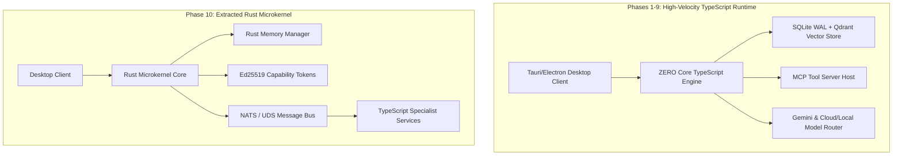

# ARCHITECTURE.md — High-Level Architecture Guide for Project ZERO

---

## 1. Architectural Strategy: Software First, Microkernel Later

Project ZERO adopts a **Pragmatic Vertical-Slice Architecture Strategy**:
> *"Build working software first; extract microkernel primitives from proven code later."*

---

## 2. Module Responsibilities

1. **Model Router**: Evaluates cost, latency, SLA, and privacy to route inference calls dynamically to Gemini, Claude, or local Ollama instances.
2. **Context & Memory Subsystem**: Manages active context window allocation, SQLite WAL episodic event logs (`zero.db`), Qdrant vector embeddings, and KuzuDB entity graphs.
3. **Tool Execution Harness**: Hosts MCP client/server instances, verifies tool schemas, and manages sandboxed execution boundaries.
4. **Task Engine**: Manages Directed Acyclic Task Graphs (DAGs) for dynamic planning, pre-condition assertion checks, step observations, and plan repairs.
5. **Security Manager**: Validates Capability Tokens, scans code ASTs for unsafe syscalls, and manages user permission consent prompts.

---

## 3. Dependency Rules & Event Flow

- **Strict Upward Layering**: Lower-level storage and hardware adapters MUST NOT depend on higher-level user UI or specialist engine code.
- **Asynchronous IPC**: All intra-component communications use event-driven JSON-RPC 2.0 messages over TypeScript event emitters (Phases 1-9) or NATS IPC (Phase 10).
